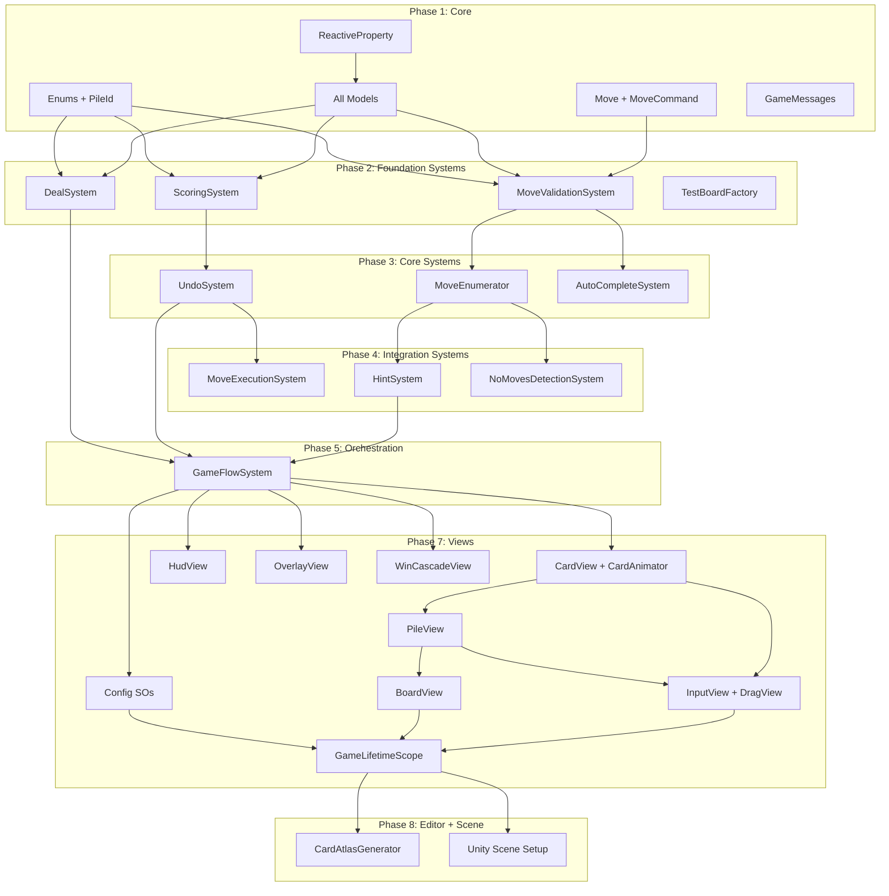

# Klondike Solitaire — Execution Workflow Plan
**Version:** 1.0
**Date:** 2026-04-08
**Based on:** GDD v1.0, TDD v1.2
**Status:** Ready for Orchestration

---

## 1. Overview

- **Total phases:** 9
- **Total tasks:** 45
- **Estimated parallel efficiency:** ~73% (45 tasks, ~12 effective serial steps with 4-6 concurrent agents)
- **Critical path length:** 9 phases, bottleneck chain: Core → MoveValidation → MoveEnumerator → HintSystem → GameFlowSystem → Views → Scene Setup → Runtime Validation
- **Recommended agent team:** 4 coders, 2 testers, 1 reviewer, 1 unity-setup agent

---

## 2. Dependency Graph

### System-Level Dependencies

```
Core Foundation (enums, models, data, messages, reactive)
│
├──► DealSystem ─────────────────────────────────────────┐
├──► MoveValidationSystem ─┬──► MoveEnumerator ─┬──► HintSystem ──────┐
│                          ├──► AutoCompleteSystem       │              │
│                          │                    └──► NoMovesDetection  │
├──► ScoringSystem ──► UndoSystem ──► MoveExecutionSystem              │
│                                                                      │
└──────────────────────── GameFlowSystem ◄─────────────────────────────┘
                              │          (needs: Deal, Undo, Hint)
                              ▼
                     Views Layer (all views)
                              │
                     ┌────────┴────────┐
                     ▼                 ▼
              Editor Tools      Unity Scene Setup
                     │                 │
                     └────────┬────────┘
                              ▼
                   Integration & Runtime Validation
```

### Mermaid Diagram



---

## 3. Phases

### Phase 1: Core Foundation
**Goal:** Establish all Core assembly types — enums, models, data structures, messages, and reactive utilities.
**Parallel Capacity:** 5 agents
**Entry Criteria:** None (first phase)
**Exit Criteria:** All Core assembly files compile. Assembly definition references nothing outside itself.

#### P1.T1: Enums and PileId
- **Type:** infrastructure
- **Agent:** coder
- **Complexity:** S
- **Inputs:** TDD §8.1, §16 (Class Index — Core Assembly)
- **Outputs:**
  - `Assets/Scripts/Core/Enums/Suit.cs`
  - `Assets/Scripts/Core/Enums/Rank.cs`
  - `Assets/Scripts/Core/Enums/PileType.cs`
  - `Assets/Scripts/Core/Enums/PileId.cs`
  - `Assets/Scripts/Core/Enums/GamePhase.cs`
  - `Assets/Scripts/Core/Enums/MoveType.cs`
  - `Assets/Scripts/Core/KlondikeSolitaire.Core.asmdef`
- **Description:**
  Create all enumerations and the PileId struct per TDD §16.
  - `Suit`: Hearts, Diamonds, Clubs, Spades
  - `Rank`: Ace=1 through King=13 (int-backed)
  - `PileType`: Stock, Waste, Foundation, Tableau
  - `PileId`: readonly struct with `PileType Type` and `int Index`. Include equality, GetHashCode, ToString
  - `GamePhase`: Dealing, Playing, AutoCompleting, Won, NoMoves
  - `MoveType`: WasteToTableau, WasteToFoundation, TableauToFoundation, FoundationToTableau, TableauToTableau, FlipCard, DrawFromStock, RecycleWaste
  - Assembly definition: no references (pure C# only, no Unity assemblies)
  - Include `CardColor` as a helper — either a separate enum or an extension method on Suit returning Red/Black
- **Acceptance Criteria:**
  - [ ] All enums have correct values per TDD
  - [ ] PileId is readonly struct with proper equality
  - [ ] Rank has int values 1-13
  - [ ] Assembly definition has zero assembly references
  - [ ] No `using UnityEngine` anywhere
- **Parallel Group:** P1-A

#### P1.T2: ReactiveProperty and CompositeDisposable
- **Type:** infrastructure
- **Agent:** coder
- **Complexity:** S
- **Inputs:** TDD §7.1
- **Outputs:**
  - `Assets/Scripts/Core/Reactive/ReactiveProperty.cs`
  - `Assets/Scripts/Core/Reactive/CompositeDisposable.cs`
- **Description:**
  Minimal observable property per TDD §7.1. ~50 lines for ReactiveProperty, ~30 for CompositeDisposable.
  - `ReactiveProperty<T>`: holds value, compares with `EqualityComparer<T>.Default` on set, notifies subscribers on change. `Subscribe(Action<T>)` returns `IDisposable`. No Unity dependency.
  - `CompositeDisposable`: collects `IDisposable` subscriptions. `Add(IDisposable)` and `Dispose()` disposes all. Include `AddTo` extension method for chaining: `subscription.AddTo(composite)`.
  - Zero allocation on notification (use a `List<Action<T>>` pre-allocated).
- **Acceptance Criteria:**
  - [ ] ReactiveProperty notifies subscribers on value change
  - [ ] ReactiveProperty skips notification when value is equal
  - [ ] Subscribe returns IDisposable that removes the subscription
  - [ ] CompositeDisposable disposes all added subscriptions
  - [ ] AddTo extension method works for chaining
  - [ ] No `using UnityEngine`
- **Parallel Group:** P1-A

#### P1.T3: Data Structures
- **Type:** infrastructure
- **Agent:** coder
- **Complexity:** S
- **Inputs:** TDD §8.4, §8.6, §8.5 (MoveCommand, Move, ScoringValues)
- **Outputs:**
  - `Assets/Scripts/Core/Data/Move.cs`
  - `Assets/Scripts/Core/Data/MoveCommand.cs`
  - `Assets/Scripts/Core/Data/ScoringTable.cs`
- **Description:**
  Create data structs per TDD:
  - `Move`: readonly struct — `PileId Source`, `PileId Destination`, `int CardCount`. Used by MoveEnumerator, HintSystem, validation.
  - `MoveCommand`: readonly struct — undo record per TDD §8.6. Fields: `MoveType Type`, `PileId Source`, `PileId Destination`, `int CardCount`, `int ScoreDelta`, `bool WasCardFlipped`, `int WasteCardCount` (for RecycleWaste only).
  - `ScoringTable`: readonly struct — holds point values for each MoveType as int fields (`WasteToTableau`, `WasteToFoundation`, `TableauToFoundation`, `FoundationToTableau`, `FlipCard`). This bridges the SO config (Views assembly) and ScoringSystem (Systems assembly, no Unity dependency). Constructor takes all values.
- **Acceptance Criteria:**
  - [ ] Move is readonly struct with correct fields
  - [ ] MoveCommand is readonly struct with all undo metadata per TDD §8.6
  - [ ] ScoringTable is readonly struct with all scoring values
  - [ ] No `using UnityEngine`
- **Parallel Group:** P1-A

#### P1.T4: Models
- **Type:** infrastructure
- **Agent:** coder
- **Complexity:** M
- **Inputs:** TDD §8.1, P1.T1 (enums), P1.T2 (ReactiveProperty)
- **Outputs:**
  - `Assets/Scripts/Core/Models/CardModel.cs`
  - `Assets/Scripts/Core/Models/PileModel.cs`
  - `Assets/Scripts/Core/Models/BoardModel.cs`
  - `Assets/Scripts/Core/Models/ScoreModel.cs`
  - `Assets/Scripts/Core/Models/GamePhaseModel.cs`
- **Description:**
  All game models per TDD §8.1:
  - `CardModel`: `Suit` (readonly), `Rank` (readonly), `IsFaceUp` (ReactiveProperty\<bool\>). Derived: `Color` (Red if Hearts/Diamonds, else Black), `Value` (int 1-13 from Rank).
  - `PileModel`: `PileType`, `PileIndex`, `Cards` (List\<CardModel\>), `TopCard` (peek or null), `Count`, `FaceUpCount`. Methods: `AddCards`, `RemoveTop(count)`, `RemoveAll()`. Cards ordered bottom-to-top.
  - `BoardModel`: `Stock` (PileModel), `Waste` (PileModel), `Foundations` (PileModel[4]), `Tableau` (PileModel[7]). `GetPile(PileId)` for unified access. `AllPiles` for flat iteration.
  - `ScoreModel`: `Score` (ReactiveProperty\<int\>).
  - `GamePhaseModel`: `Phase` (ReactiveProperty\<GamePhase\>).
  - Models depend on NOTHING except Core enums and ReactiveProperty. No Unity API.
- **Acceptance Criteria:**
  - [ ] CardModel has readonly Suit/Rank, observable IsFaceUp, derived Color and Value
  - [ ] PileModel manages an ordered card list with add/remove/peek operations
  - [ ] BoardModel provides GetPile(PileId) that returns the correct pile
  - [ ] BoardModel.AllPiles iterates all 13 piles
  - [ ] ScoreModel and GamePhaseModel use ReactiveProperty
  - [ ] No `using UnityEngine`
- **Parallel Group:** P1-A

#### P1.T5: Game Messages
- **Type:** infrastructure
- **Agent:** coder
- **Complexity:** S
- **Inputs:** TDD §7.2 (MessagePipe Configuration table)
- **Outputs:**
  - `Assets/Scripts/Core/Messages/GameMessages.cs`
- **Description:**
  All 12 message types in a single file per TDD §7.2. Each is a `readonly struct`.
  - `CardMovedMessage`: `PileId SourcePileId`, `PileId DestPileId`, `int CardCount`
  - `CardFlippedMessage`: `PileId PileId`, `int CardIndex`
  - `ScoreChangedMessage`: `int NewScore`, `int Delta`
  - `GamePhaseChangedMessage`: `GamePhase NewPhase`
  - `AutoCompleteAvailableMessage`: `bool IsAvailable`
  - `UndoAvailabilityChangedMessage`: `bool IsAvailable`
  - `HintHighlightMessage`: `int SourceCardIndex`, `PileId SourcePileId`, `PileId[] DestPileIds`
  - `HintClearedMessage`: (empty)
  - `BoardStateChangedMessage`: (empty)
  - `NoMovesDetectedMessage`: (empty)
  - `WinDetectedMessage`: `int FinalScore`
  - `NewGameRequestedMessage`: (empty)
  - Each struct has a constructor for non-empty payloads.
  - NOTE: `HintHighlightMessage.DestPileIds` is a `PileId[]` — this is an allocation, acceptable since hints are infrequent. Alternatively use a fixed-size buffer or Span if agents prefer.
- **Acceptance Criteria:**
  - [ ] All 12 message types defined as readonly struct
  - [ ] Payloads match TDD §7.2 table exactly
  - [ ] No `using UnityEngine`
- **Parallel Group:** P1-A

---

### Phase 2: Foundation Systems + Test Infrastructure
**Goal:** Implement the three independent game logic systems and set up test infrastructure.
**Parallel Capacity:** 4 agents
**Entry Criteria:** Phase 1 complete — all Core assembly files exist
**Exit Criteria:** All three systems compile against Core. Test infrastructure compiles. Systems assembly definition is correct.

#### P2.T1: DealSystem
- **Type:** logic
- **Agent:** coder
- **Complexity:** S
- **Inputs:** `Assets/Scripts/Core/` (all), TDD §8.2
- **Outputs:**
  - `Assets/Scripts/Systems/DealSystem.cs`
  - `Assets/Scripts/Systems/KlondikeSolitaire.Systems.asmdef`
- **Description:**
  Implement DealSystem per TDD §8.2. Also create the Systems assembly definition.
  - Constructor: takes `BoardModel` and `IPublisher<DealCompletedMessage>` (MessagePipe)
  - `CreateDeal()`: Create 52 CardModels (all face-down), Fisher-Yates shuffle using `System.Random`. Deal to 7 tableau columns (column N gets N+1 cards, 0-indexed), flip top card face-up. Remaining 24 to Stock.
  - Publish `DealCompletedMessage` after setup.
  - `Reset()`: Clear all piles in BoardModel.
  - Assembly def references: `KlondikeSolitaire.Core`, `MessagePipe`
  - NO `using UnityEngine` in Systems assembly
- **Acceptance Criteria:**
  - [ ] Creates exactly 52 unique cards (4 suits × 13 ranks)
  - [ ] Fisher-Yates shuffle implementation is correct
  - [ ] Tableau column i gets i+1 cards (28 total), top card face-up
  - [ ] Remaining 24 cards go to Stock, all face-down
  - [ ] Publishes DealCompletedMessage
  - [ ] Systems asmdef references only Core and MessagePipe
- **Parallel Group:** P2-A

#### P2.T2: MoveValidationSystem
- **Type:** logic
- **Agent:** coder
- **Complexity:** M
- **Inputs:** `Assets/Scripts/Core/` (all), TDD §8.3
- **Outputs:**
  - `Assets/Scripts/Systems/MoveValidationSystem.cs`
- **Description:**
  Stateless validation per TDD §8.3. Pure function, no side effects.
  - `IsValidMove(BoardModel board, PileId source, PileId dest, int cardCount) → bool`
  - Implement all validation rules from TDD §8.3:
    - Tableau→Tableau: descending alternating color, King-only on empty
    - Tableau→Foundation: single card, Ace on empty, suit match + ascending rank
    - Waste→Tableau: same as Tableau→Tableau with 1 card
    - Waste→Foundation: same as Tableau→Foundation
    - Foundation→Tableau: single card, standard tableau placement rules
  - `FindBestTarget(BoardModel board, PileId source, int cardCount) → PileId?`
    - Priority: Foundation first (if single card + valid), then leftmost valid Tableau column
    - Returns null if no valid target
  - Constructor: takes nothing (stateless). Or takes `BoardModel` if preferred for convenience, but methods should accept board as parameter for testability.
- **Acceptance Criteria:**
  - [ ] IsValidMove correctly validates all 5 move type combinations
  - [ ] Empty tableau only accepts Kings
  - [ ] Empty foundation only accepts Aces
  - [ ] Foundation enforces suit match + ascending rank
  - [ ] Tableau enforces alternating colors + descending rank
  - [ ] FindBestTarget returns Foundation before Tableau
  - [ ] FindBestTarget returns leftmost valid Tableau column
  - [ ] Stateless — no instance state, no side effects
- **Parallel Group:** P2-A

#### P2.T3: ScoringSystem
- **Type:** logic
- **Agent:** coder
- **Complexity:** S
- **Inputs:** `Assets/Scripts/Core/` (all), TDD §8.5
- **Outputs:**
  - `Assets/Scripts/Systems/ScoringSystem.cs`
- **Description:**
  Score tracking per TDD §8.5.
  - Constructor: `ScoreModel`, `ScoringTable`, `IPublisher<ScoreChangedMessage>`
  - `CalculateScore(MoveType type) → int`: lookup from ScoringTable. Returns point delta for the move type.
  - `ApplyDelta(int delta)`: adds delta to ScoreModel.Score.Value, clamps to 0, publishes ScoreChangedMessage.
  - `Reset()`: sets score to 0, publishes ScoreChangedMessage.
  - NOTE: ScoringSystem takes `ScoringTable` (plain C# struct from Core), not the ScriptableObject directly. The SO lives in Views; VContainer bridges them.
- **Acceptance Criteria:**
  - [ ] CalculateScore returns correct points for every MoveType per TDD §8.5 table
  - [ ] ApplyDelta adds to score and clamps to minimum 0
  - [ ] Publishes ScoreChangedMessage with new score and delta
  - [ ] Reset sets score to 0
  - [ ] No `using UnityEngine`
- **Parallel Group:** P2-A

#### P2.T4: Test Infrastructure
- **Type:** test
- **Agent:** tester
- **Complexity:** M
- **Inputs:** `Assets/Scripts/Core/` (all), TDD §14
- **Outputs:**
  - `Assets/Tests/EditMode/KlondikeSolitaire.Tests.EditMode.asmdef`
  - `Assets/Tests/EditMode/Helpers/TestBoardFactory.cs`
  - `Assets/Tests/EditMode/Helpers/TestPublisher.cs`
- **Description:**
  Set up test helpers per TDD §14:
  - Assembly definition references: `KlondikeSolitaire.Core`, `KlondikeSolitaire.Systems`, `MessagePipe`, `NUnit`
  - `TestBoardFactory` (static class): builds known board states for testing:
    - `EmptyBoard()` — all piles empty
    - `StandardDealBoard()` — valid dealt board (28 cards in tableau, 24 in stock)
    - `AlmostWonBoard()` — one card remaining to place on foundation
    - `NoMovesBoard()` — board with zero valid moves (stock empty, waste empty, no valid tableau/foundation moves)
    - `AutoCompletableBoard()` — all face-up, empty stock and waste
    - `CustomBoard(Action<BoardModel> setup)` — empty board passed to a setup lambda
    - Each method creates CardModels and PileModels from scratch with known values
  - `TestPublisher<T>`: implements `IPublisher<T>` (MessagePipe interface). Captures all published messages in a `List<T>` for assertions. Include `LastMessage`, `MessageCount`, `Clear()`.
- **Acceptance Criteria:**
  - [ ] Assembly def compiles with correct references
  - [ ] TestBoardFactory.EmptyBoard returns board with all empty piles
  - [ ] TestBoardFactory.StandardDealBoard returns valid 28/24 deal
  - [ ] TestBoardFactory.AlmostWonBoard has 51 cards on foundations
  - [ ] TestBoardFactory.NoMovesBoard has zero valid moves
  - [ ] TestPublisher captures published messages for assertion
- **Parallel Group:** P2-A

---

### Phase 3: Core Systems + Foundation Tests
**Goal:** Implement dependent systems (UndoSystem, MoveEnumerator, AutoCompleteSystem) while testers write tests for Phase 2 systems.
**Parallel Capacity:** 6 agents (3 coders + 3 testers)
**Entry Criteria:** Phase 2 complete — all foundation systems and test infrastructure exist
**Exit Criteria:** All Phase 3 systems compile. Phase 2 system tests pass.

#### P3.T1: UndoSystem
- **Type:** logic
- **Agent:** coder
- **Complexity:** M
- **Inputs:** `Assets/Scripts/Systems/ScoringSystem.cs`, `Assets/Scripts/Core/` (all), TDD §8.6
- **Outputs:**
  - `Assets/Scripts/Systems/UndoSystem.cs`
- **Description:**
  Command pattern undo per TDD §8.6.
  - Constructor: `BoardModel`, `ScoringSystem`, `IPublisher<UndoAvailabilityChangedMessage>`, `IPublisher<BoardStateChangedMessage>`, `IPublisher<CardFlippedMessage>`
  - `Push(MoveCommand command)`: push to stack, publish UndoAvailabilityChangedMessage(true)
  - `Undo()`: pop from stack, reverse the move per TDD §8.6 pseudo code:
    - Normal: move cards back, un-flip if WasCardFlipped, reverse score delta
    - DrawFromStock: move waste top to stock, flip face-down
    - RecycleWaste: move all stock cards back to waste, flip face-up, restore order
    - Publish BoardStateChangedMessage after undo
    - Publish UndoAvailabilityChangedMessage
  - `Clear()`: clear stack, publish UndoAvailabilityChangedMessage(false)
  - `CanUndo`: bool property (stack count > 0)
  - Implement `IDisposable` (no subscriptions, but Systems interface consistency)
- **Acceptance Criteria:**
  - [ ] Push adds command to stack
  - [ ] Undo reverses Normal moves correctly (cards back, score reversed)
  - [ ] Undo reverses DrawFromStock (card back to stock, face-down)
  - [ ] Undo reverses RecycleWaste (cards back to waste, face-up)
  - [ ] Undo handles WasCardFlipped (un-flips card on source)
  - [ ] Clear empties the stack
  - [ ] Publishes UndoAvailabilityChangedMessage on push/undo/clear
  - [ ] Publishes BoardStateChangedMessage after undo
- **Parallel Group:** P3-A

#### P3.T2: MoveEnumerator
- **Type:** logic
- **Agent:** coder
- **Complexity:** M
- **Inputs:** `Assets/Scripts/Systems/MoveValidationSystem.cs`, `Assets/Scripts/Core/` (all), TDD §8.7
- **Outputs:**
  - `Assets/Scripts/Systems/MoveEnumerator.cs`
- **Description:**
  Shared stateless utility per TDD §8.7. Static class — no instance state, no subscriptions.
  - `EnumerateAllValidMoves(BoardModel board, MoveValidationSystem validation, List<Move> results)`:
    - Clear results list (caller pre-allocates to avoid allocation)
    - Enumerate in priority order per TDD §8.7:
      1. Waste → each Foundation
      2. Waste → each Tableau column
      3. Each Tableau → each Foundation (top card only)
      4. Each Tableau → each Tableau (each valid face-up sub-sequence starting point)
      5. Stock draw (if stock has cards)
    - For Tableau→Tableau: iterate each source column, for each face-up card position, try moving the sub-sequence from that card to top to every other destination column
  - `HasAnyValidMove(BoardModel board, MoveValidationSystem validation) → bool`:
    - Same enumeration order, but returns true on first valid move found (short-circuit)
    - Also returns true if stock has cards (drawing from stock is always a valid "move")
- **Acceptance Criteria:**
  - [ ] EnumerateAllValidMoves finds all valid moves on a given board
  - [ ] Enumeration order matches TDD §8.7 priority
  - [ ] Tableau→Tableau considers all valid sub-sequences, not just top card
  - [ ] HasAnyValidMove short-circuits on first valid move
  - [ ] HasAnyValidMove returns true if stock has cards
  - [ ] Stateless — no instance fields
  - [ ] Uses caller-provided List (no allocation)
- **Parallel Group:** P3-A

#### P3.T3: AutoCompleteSystem
- **Type:** logic
- **Agent:** coder
- **Complexity:** S
- **Inputs:** `Assets/Scripts/Systems/MoveValidationSystem.cs`, `Assets/Scripts/Core/` (all), TDD §8.9
- **Outputs:**
  - `Assets/Scripts/Systems/AutoCompleteSystem.cs`
- **Description:**
  Auto-complete detection and sequence generation per TDD §8.9.
  - Constructor: `BoardModel`, `MoveValidationSystem`, `ISubscriber<BoardStateChangedMessage>`, `IPublisher<AutoCompleteAvailableMessage>`
  - On `BoardStateChangedMessage`: call `IsAutoCompletePossible()`, publish `AutoCompleteAvailableMessage`
  - `IsAutoCompletePossible()`: stock empty AND waste empty AND all tableau cards face-up
  - `GenerateMoveSequence() → List<Move>`: repeatedly find lowest-rank card that can go to its foundation, add to list. Stop when no more moves. Per TDD §8.9 pseudo code.
  - Implement `IDisposable` for MessagePipe subscription cleanup.
  - **TDD note:** Auto-complete moves do NOT push to undo stack. Won is a terminal state. The sequence is generated here; BoardView executes it with animation.
- **Acceptance Criteria:**
  - [ ] IsAutoCompletePossible returns true only when stock empty, waste empty, all tableau face-up
  - [ ] GenerateMoveSequence returns optimal order (lowest rank first)
  - [ ] Subscribes to BoardStateChangedMessage and publishes AutoCompleteAvailableMessage
  - [ ] Disposes subscription in Dispose()
- **Parallel Group:** P3-A

#### P3.T4: DealSystem Tests
- **Type:** test
- **Agent:** tester
- **Complexity:** M
- **Inputs:** `Assets/Scripts/Systems/DealSystem.cs`, `Assets/Tests/EditMode/Helpers/`, TDD §14
- **Outputs:**
  - `Assets/Tests/EditMode/DealSystemTests.cs`
- **Description:**
  Unit tests for DealSystem. Target: 80% coverage per TDD §14.
  - Test Fisher-Yates produces 52 unique cards
  - Test tableau column i has i+1 cards after deal
  - Test only top card of each tableau column is face-up
  - Test stock has 24 cards, all face-down
  - Test waste is empty after deal
  - Test foundations are empty after deal
  - Test total cards across all piles = 52
  - Test Reset clears all piles
  - Test DealCompletedMessage is published
- **Acceptance Criteria:**
  - [ ] All listed test cases pass
  - [ ] Tests use TestBoardFactory and TestPublisher where appropriate
  - [ ] Each test method has a single assertion focus
- **Parallel Group:** P3-B

#### P3.T5: MoveValidationSystem Tests
- **Type:** test
- **Agent:** tester
- **Complexity:** L
- **Inputs:** `Assets/Scripts/Systems/MoveValidationSystem.cs`, `Assets/Tests/EditMode/Helpers/`, TDD §14
- **Outputs:**
  - `Assets/Tests/EditMode/MoveValidationSystemTests.cs`
- **Description:**
  Unit tests for MoveValidationSystem. Target: 95% coverage. This is the most test-heavy system.
  - Tableau→Tableau: valid alternating color descending, invalid same color, invalid wrong rank, King on empty, non-King rejected on empty, multi-card sequence move
  - Tableau→Foundation: Ace on empty, reject non-Ace on empty, correct suit+rank, wrong suit rejected, wrong rank rejected, only single card allowed
  - Waste→Tableau: valid placement, invalid placement
  - Waste→Foundation: valid, invalid
  - Foundation→Tableau: valid, invalid
  - FindBestTarget: foundation preferred over tableau, leftmost tableau chosen, null when no target
  - Edge cases: empty piles, full foundations, moving from empty pile
- **Acceptance Criteria:**
  - [ ] Tests cover all 5 move type combinations (valid + invalid)
  - [ ] Tests cover FindBestTarget priority logic
  - [ ] Edge cases for empty piles covered
  - [ ] Each test uses Arrange-Act-Assert with clear naming
- **Parallel Group:** P3-B

#### P3.T6: ScoringSystem Tests
- **Type:** test
- **Agent:** tester
- **Complexity:** S
- **Inputs:** `Assets/Scripts/Systems/ScoringSystem.cs`, `Assets/Tests/EditMode/Helpers/`, TDD §14
- **Outputs:**
  - `Assets/Tests/EditMode/ScoringSystemTests.cs`
- **Description:**
  Unit tests for ScoringSystem. Target: 100% coverage.
  - CalculateScore returns correct points for each MoveType
  - ApplyDelta increases score
  - ApplyDelta with negative delta decreases score
  - Score clamps to 0 (never negative)
  - Reset sets score to 0
  - ScoreChangedMessage published with correct values
- **Acceptance Criteria:**
  - [ ] Every MoveType has a test for CalculateScore
  - [ ] Clamping to 0 is tested
  - [ ] Message publication is verified via TestPublisher
- **Parallel Group:** P3-B

---

### Phase 4: Integration Systems + Core Tests
**Goal:** Implement systems that connect other systems. Testers write tests for Phase 3 systems.
**Parallel Capacity:** 5 agents (3 coders + 2 testers)
**Entry Criteria:** Phase 3 complete — UndoSystem, MoveEnumerator, AutoCompleteSystem exist. Phase 2 tests pass.
**Exit Criteria:** MoveExecutionSystem, HintSystem, NoMovesDetectionSystem compile. Phase 3 tests pass.

#### P4.T1: MoveExecutionSystem
- **Type:** logic
- **Agent:** coder
- **Complexity:** M
- **Inputs:** `Assets/Scripts/Systems/ScoringSystem.cs`, `Assets/Scripts/Systems/UndoSystem.cs`, `Assets/Scripts/Core/`, TDD §8.4
- **Outputs:**
  - `Assets/Scripts/Systems/MoveExecutionSystem.cs`
- **Description:**
  Execute validated moves per TDD §8.4.
  - Constructor: `BoardModel`, `ScoringSystem`, `UndoSystem`, `IPublisher<CardMovedMessage>`, `IPublisher<CardFlippedMessage>`, `IPublisher<BoardStateChangedMessage>`
  - `ExecuteMove(PileId source, PileId dest, int cardCount)`:
    1. Remove cards from source pile
    2. Add cards to destination pile
    3. Determine MoveType from source/dest PileTypes
    4. Calculate score delta via ScoringSystem
    5. Auto-flip: if source is Tableau and new top card is face-down → flip face-up, add flip score, publish CardFlippedMessage
    6. Apply score via ScoringSystem.ApplyDelta
    7. Push MoveCommand to UndoSystem
    8. Publish CardMovedMessage + BoardStateChangedMessage
  - `DrawFromStock()`: move top stock card to waste, flip face-up. Push undo command (MoveType=DrawFromStock). Publish messages.
  - `RecycleWaste()`: move all waste to stock in order, flip all face-down. Push undo command (MoveType=RecycleWaste, WasteCardCount). Publish messages.
  - Implement `IDisposable`.
- **Acceptance Criteria:**
  - [ ] ExecuteMove transfers cards between piles correctly
  - [ ] Auto-flip works when tableau source has face-down card on top after move
  - [ ] Score delta calculated and applied correctly for each move type
  - [ ] Undo command pushed with correct metadata (including WasCardFlipped)
  - [ ] DrawFromStock moves 1 card, flips face-up
  - [ ] RecycleWaste moves all waste to stock, preserves order, flips face-down
  - [ ] All three message types published appropriately
- **Parallel Group:** P4-A

#### P4.T2: HintSystem
- **Type:** logic
- **Agent:** coder
- **Complexity:** S
- **Inputs:** `Assets/Scripts/Systems/MoveEnumerator.cs`, `Assets/Scripts/Systems/MoveValidationSystem.cs`, `Assets/Scripts/Core/`, TDD §8.8
- **Outputs:**
  - `Assets/Scripts/Systems/HintSystem.cs`
- **Description:**
  Hint cycling per TDD §8.8.
  - Constructor: `BoardModel`, `MoveValidationSystem`, `ISubscriber<BoardStateChangedMessage>`, `IPublisher<HintHighlightMessage>`, `IPublisher<HintClearedMessage>`
  - On `BoardStateChangedMessage`: invalidate cached moves, reset index, publish HintClearedMessage
  - `GetNextHint()`:
    1. If cached moves is null, call `MoveEnumerator.EnumerateAllValidMoves()` to populate
    2. If no moves: return (no-op)
    3. Advance index: `(_hintIndex + 1) % count`
    4. Publish HintHighlightMessage with current hint move
  - `Reset()`: clear cache, reset index, publish HintClearedMessage
  - Pre-allocate `List<Move>` for MoveEnumerator (reuse across calls).
  - Implement `IDisposable` for subscription cleanup.
- **Acceptance Criteria:**
  - [ ] First hint call populates cache from MoveEnumerator
  - [ ] Subsequent calls cycle through cached moves
  - [ ] Index wraps around to 0 after reaching end
  - [ ] BoardStateChangedMessage clears cache and publishes HintClearedMessage
  - [ ] No-op when no valid moves exist
  - [ ] Reuses pre-allocated list (no allocation per call)
- **Parallel Group:** P4-A

#### P4.T3: NoMovesDetectionSystem
- **Type:** logic
- **Agent:** coder
- **Complexity:** S
- **Inputs:** `Assets/Scripts/Systems/MoveEnumerator.cs`, `Assets/Scripts/Systems/MoveValidationSystem.cs`, `Assets/Scripts/Core/`, TDD §8.10
- **Outputs:**
  - `Assets/Scripts/Systems/NoMovesDetectionSystem.cs`
- **Description:**
  No-moves detection per TDD §8.10.
  - Constructor: `BoardModel`, `MoveValidationSystem`, `GamePhaseModel`, `ISubscriber<BoardStateChangedMessage>`, `IPublisher<NoMovesDetectedMessage>`
  - On `BoardStateChangedMessage`:
    1. If `GamePhaseModel.Phase.Value != GamePhase.Playing`: return (don't check during dealing, auto-completing, won, or already no-moves)
    2. If `MoveEnumerator.HasAnyValidMove(board, validation)`: return
    3. Publish `NoMovesDetectedMessage`
  - Implement `IDisposable`.
- **Acceptance Criteria:**
  - [ ] Publishes NoMovesDetectedMessage when no valid moves exist
  - [ ] Does NOT publish during non-Playing phases
  - [ ] Uses HasAnyValidMove (short-circuit, not full enumeration)
  - [ ] Handles empty stock + empty waste + stuck tableau correctly
- **Parallel Group:** P4-A

#### P4.T4: UndoSystem Tests
- **Type:** test
- **Agent:** tester
- **Complexity:** M
- **Inputs:** `Assets/Scripts/Systems/UndoSystem.cs`, `Assets/Tests/EditMode/Helpers/`, TDD §14
- **Outputs:**
  - `Assets/Tests/EditMode/UndoSystemTests.cs`
- **Description:**
  Unit tests for UndoSystem. Target: 95% coverage.
  - Push and CanUndo state
  - Undo Normal move: cards moved back, score reversed
  - Undo with WasCardFlipped: card un-flipped
  - Undo DrawFromStock: card back to stock, face-down
  - Undo RecycleWaste: cards back to waste in order, face-up
  - Multi-step undo (push 3, undo 3)
  - Clear empties stack, CanUndo = false
  - UndoAvailabilityChangedMessage published correctly
  - BoardStateChangedMessage published on undo
- **Acceptance Criteria:**
  - [ ] All undo scenarios tested per TDD §8.6
  - [ ] Multi-step undo verified
  - [ ] Messages verified via TestPublisher
- **Parallel Group:** P4-B

#### P4.T5: AutoCompleteSystem Tests
- **Type:** test
- **Agent:** tester
- **Complexity:** M
- **Inputs:** `Assets/Scripts/Systems/AutoCompleteSystem.cs`, `Assets/Tests/EditMode/Helpers/`, TDD §14
- **Outputs:**
  - `Assets/Tests/EditMode/AutoCompleteSystemTests.cs`
- **Description:**
  Unit tests for AutoCompleteSystem. Target: 90% coverage.
  - IsAutoCompletePossible: true when all conditions met
  - IsAutoCompletePossible: false when stock has cards
  - IsAutoCompletePossible: false when waste has cards
  - IsAutoCompletePossible: false when tableau has face-down cards
  - GenerateMoveSequence: returns correct sequence (lowest rank first)
  - GenerateMoveSequence: handles multiple columns with same-rank cards
  - AutoCompleteAvailableMessage published on board state change
- **Acceptance Criteria:**
  - [ ] All detection conditions tested individually
  - [ ] Sequence optimality verified
  - [ ] Message publication verified
- **Parallel Group:** P4-B

---

### Phase 5: Orchestration System + Integration System Tests
**Goal:** Implement GameFlowSystem (the top-level state machine). Testers write tests for Phase 4 systems.
**Parallel Capacity:** 4 agents (1 coder + 3 testers)
**Entry Criteria:** Phase 4 complete — MoveExecution, Hint, NoMovesDetection exist. Phase 3 tests pass.
**Exit Criteria:** GameFlowSystem compiles. Phase 4 system tests pass. All systems compile together.

#### P5.T1: GameFlowSystem
- **Type:** logic
- **Agent:** coder
- **Complexity:** M
- **Inputs:** All Systems files, `Assets/Scripts/Core/`, TDD §8.11
- **Outputs:**
  - `Assets/Scripts/Systems/GameFlowSystem.cs`
- **Description:**
  Top-level state machine per TDD §8.11.
  - Constructor: `GamePhaseModel`, `DealSystem`, `BoardModel`, `ScoreModel`, `UndoSystem`, `HintSystem`, `AutoCompleteSystem`, `ISubscriber<BoardStateChangedMessage>`, `ISubscriber<NoMovesDetectedMessage>`, `ISubscriber<NewGameRequestedMessage>`, `IPublisher<GamePhaseChangedMessage>`, `IPublisher<WinDetectedMessage>`, `IPublisher<DealCompletedMessage>`
  - State transitions per TDD §8.11 diagram:
    - `StartNewGame()`: Reset all systems (DealSystem.Reset, ScoringSystem.Reset, UndoSystem.Clear, HintSystem.Reset), set phase to Dealing, call DealSystem.CreateDeal(), set phase to Playing, publish GamePhaseChangedMessage + DealCompletedMessage
    - On `BoardStateChangedMessage`: check win condition (all 4 foundations have 13 cards). If won → set phase to Won, publish WinDetectedMessage + GamePhaseChangedMessage. Only check during Playing or AutoCompleting phases.
    - On `NoMovesDetectedMessage`: set phase to NoMoves, publish GamePhaseChangedMessage
    - On `NewGameRequestedMessage`: call StartNewGame()
    - `StartAutoComplete()`: set phase to AutoCompleting, publish GamePhaseChangedMessage. (View handles animation; win triggers via BoardStateChangedMessage when foundations fill up)
  - Won and NoMoves are **terminal states** (only New Game exits them). Undo is disabled.
  - Implement `IDisposable` and `IStartable` (VContainer entry point) — call StartNewGame() on Start.
- **Acceptance Criteria:**
  - [ ] StartNewGame resets all systems and deals
  - [ ] Phase transitions match TDD §8.11 state diagram exactly
  - [ ] Win detected when all 4 foundations have 13 cards
  - [ ] Win check only runs during Playing and AutoCompleting phases
  - [ ] NoMovesDetectedMessage sets phase to NoMoves
  - [ ] NewGameRequestedMessage triggers StartNewGame
  - [ ] StartAutoComplete sets phase to AutoCompleting
  - [ ] Won and NoMoves are terminal (no undo)
  - [ ] Implements IDisposable for subscription cleanup
- **Parallel Group:** P5-A

#### P5.T2: MoveExecutionSystem Tests
- **Type:** test
- **Agent:** tester
- **Complexity:** M
- **Inputs:** `Assets/Scripts/Systems/MoveExecutionSystem.cs`, `Assets/Tests/EditMode/Helpers/`, TDD §14
- **Outputs:**
  - `Assets/Tests/EditMode/MoveExecutionSystemTests.cs`
- **Description:**
  Unit tests for MoveExecutionSystem. Target: 90% coverage.
  - ExecuteMove: cards transferred correctly between piles
  - ExecuteMove: auto-flip works on tableau source
  - ExecuteMove: score delta calculated and applied
  - ExecuteMove: undo command pushed with correct metadata
  - DrawFromStock: card moved, flipped, undo created
  - RecycleWaste: all cards moved, order preserved, undo created
  - Messages published: CardMovedMessage, CardFlippedMessage, BoardStateChangedMessage
  - Edge case: move from pile with 1 card (pile becomes empty)
- **Acceptance Criteria:**
  - [ ] All move execution scenarios tested
  - [ ] Auto-flip verified
  - [ ] Undo command correctness verified
  - [ ] Messages verified via TestPublisher
- **Parallel Group:** P5-B

#### P5.T3: HintSystem Tests
- **Type:** test
- **Agent:** tester
- **Complexity:** M
- **Inputs:** `Assets/Scripts/Systems/HintSystem.cs`, `Assets/Tests/EditMode/Helpers/`, TDD §14
- **Outputs:**
  - `Assets/Tests/EditMode/HintSystemTests.cs`
- **Description:**
  Unit tests for HintSystem. Target: 90% coverage.
  - GetNextHint populates cache on first call
  - Cycling through hints wraps around
  - Board state change clears cache
  - Board state change publishes HintClearedMessage
  - No valid moves → GetNextHint is no-op
  - HintHighlightMessage published with correct move data
- **Acceptance Criteria:**
  - [ ] Hint cycling behavior verified
  - [ ] Cache invalidation on board change verified
  - [ ] No-op on empty board verified
- **Parallel Group:** P5-B

#### P5.T4: NoMovesDetectionSystem Tests
- **Type:** test
- **Agent:** tester
- **Complexity:** M
- **Inputs:** `Assets/Scripts/Systems/NoMovesDetectionSystem.cs`, `Assets/Tests/EditMode/Helpers/`, TDD §14
- **Outputs:**
  - `Assets/Tests/EditMode/NoMovesDetectionSystemTests.cs`
- **Description:**
  Unit tests for NoMovesDetectionSystem. Target: 90% coverage.
  - Detects no moves on a stuck board
  - Does NOT detect no moves when stock has cards
  - Does NOT detect no moves when valid tableau moves exist
  - Does NOT run during Dealing phase
  - Does NOT run during AutoCompleting phase
  - Does NOT run during Won phase
  - Publishes NoMovesDetectedMessage when no moves found in Playing phase
- **Acceptance Criteria:**
  - [ ] True deadlock detected correctly
  - [ ] False positives prevented (stock draw counts as valid move)
  - [ ] Phase filtering verified for all non-Playing phases
- **Parallel Group:** P5-B

---

### Phase 6: Final Tests + System Review
**Goal:** Complete remaining tests, verify all systems compile and tests pass. Reviewer validates.
**Parallel Capacity:** 3 agents (2 testers + 1 reviewer)
**Entry Criteria:** Phase 5 complete — GameFlowSystem exists. All Phase 4 tests pass.
**Exit Criteria:** All unit tests pass. Reviewer approves system layer. Zero compilation errors.

#### P6.T1: GameFlowSystem Tests
- **Type:** test
- **Agent:** tester
- **Complexity:** M
- **Inputs:** `Assets/Scripts/Systems/GameFlowSystem.cs`, `Assets/Tests/EditMode/Helpers/`, TDD §14
- **Outputs:**
  - `Assets/Tests/EditMode/GameFlowSystemTests.cs`
- **Description:**
  Unit tests for GameFlowSystem. Target: 85% coverage.
  - StartNewGame sets phase to Playing via Dealing
  - StartNewGame resets score, undo, hints
  - Win detection: all foundations at 13 cards → Won phase
  - Win detection only during Playing and AutoCompleting
  - NoMovesDetectedMessage → NoMoves phase
  - NewGameRequestedMessage triggers StartNewGame
  - StartAutoComplete → AutoCompleting phase
  - Won is terminal (subsequent board changes don't re-trigger)
  - NoMoves is terminal
  - Messages published for each transition
- **Acceptance Criteria:**
  - [ ] All state transitions tested
  - [ ] Terminal state behavior verified
  - [ ] System reset on new game verified
  - [ ] Messages verified via TestPublisher
- **Parallel Group:** P6-A

#### P6.T2: MoveEnumerator Tests
- **Type:** test
- **Agent:** tester
- **Complexity:** M
- **Inputs:** `Assets/Scripts/Systems/MoveEnumerator.cs`, `Assets/Tests/EditMode/Helpers/`, TDD §14
- **Outputs:**
  - `Assets/Tests/EditMode/MoveEnumeratorTests.cs`
- **Description:**
  Unit tests for MoveEnumerator. Target: 90% coverage.
  - EnumerateAllValidMoves finds all moves on a board with known valid moves
  - Enumeration is complete (no missed moves)
  - HasAnyValidMove returns true when moves exist
  - HasAnyValidMove returns false on stuck board
  - HasAnyValidMove returns true when stock has cards (draw is a valid action)
  - Empty board returns no moves
  - Tableau sub-sequence enumeration: multiple cards in a valid run
- **Acceptance Criteria:**
  - [ ] Completeness of enumeration verified on known boards
  - [ ] Short-circuit behavior of HasAnyValidMove verified
  - [ ] Stock draw counted as valid move
- **Parallel Group:** P6-A

#### P6.T3: System Layer Review
- **Type:** test
- **Agent:** coder
- **Complexity:** M
- **Inputs:** All `Assets/Scripts/Core/`, `Assets/Scripts/Systems/`, `Assets/Tests/EditMode/`
- **Outputs:** None (review only — fixes applied in-place)
- **Description:**
  Full review of the system layer:
  1. Verify all systems compile together (no missing references, no circular deps)
  2. Run ALL EditMode tests via Unity Test Runner (use `run_tests` MCP tool)
  3. Check assembly definitions are correct (Core has zero refs, Systems refs only Core+MessagePipe)
  4. Verify no `using UnityEngine` in Core or Systems assemblies
  5. Verify naming conventions: PascalCase types, _camelCase private fields, readonly struct messages
  6. Verify encapsulation: minimum visibility, no unnecessary public members
  7. Fix any issues found — this is a blocking gate before Views phase
  8. **Runtime validation**: Press Play in Unity (`manage_editor(action: "play")`), check console for compilation errors (`read_console(types: ["error"])`), then stop Play mode
- **Acceptance Criteria:**
  - [ ] Zero compilation errors
  - [ ] All EditMode tests pass
  - [ ] No UnityEngine references in Core or Systems
  - [ ] Assembly definitions are correct
  - [ ] Zero runtime errors when pressing Play
- **Parallel Group:** P6-A

---

### Phase 7: Unity Views & Integration Layer
**Goal:** Implement all MonoBehaviours, ScriptableObject definitions, and GameLifetimeScope.
**Parallel Capacity:** 4-5 agents (coders)
**Entry Criteria:** Phase 6 complete — all systems reviewed and tests pass
**Exit Criteria:** All Views compile. GameLifetimeScope wires all dependencies.

> **Internal dependency note:** Tasks in group P7-A are independent. Tasks in group P7-B depend on P7-A outputs (particularly CardView and PileView). The orchestrator should schedule P7-A first, then P7-B.

#### P7.T1: ScriptableObject Config Definitions
- **Type:** integration
- **Agent:** coder
- **Complexity:** M
- **Inputs:** `Assets/Scripts/Core/`, TDD §7.4, §11
- **Outputs:**
  - `Assets/Scripts/Views/Config/LayoutConfig.cs`
  - `Assets/Scripts/Views/Config/AnimationConfig.cs`
  - `Assets/Scripts/Views/Config/ScoringConfig.cs`
  - `Assets/Scripts/Views/Config/InputConfig.cs`
  - `Assets/Scripts/Views/Config/CardSpriteMapping.cs`
  - `Assets/Scripts/Views/KlondikeSolitaire.Views.asmdef`
- **Description:**
  All ScriptableObject definitions per TDD §7.4. Also create Views assembly definition.
  - `LayoutConfig : ScriptableObject`: pile anchor positions (Vector2[]), card size (Vector2), face-down Y offset, face-up Y offset, tableau start Y. `[CreateAssetMenu(menuName = "Klondike/Layout Config")]`
  - `AnimationConfig : ScriptableObject`: move duration, flip duration, deal delay, snap-back duration, shake amplitude, cascade speed, auto-complete delay. All float fields with `[SerializeField]`.
  - `ScoringConfig : ScriptableObject`: point values per move type. Include a `ToScoringTable()` method that returns the `ScoringTable` struct (from Core) for Systems injection.
  - `InputConfig : ScriptableObject`: drag start threshold (float, pixels), double-tap window (float, ms), tap max duration (float, ms).
  - `CardSpriteMapping : ScriptableObject`: Maps (Suit, Rank) → Sprite. Fields: `Sprite[] faceSprites` (52, indexed by suit*13+rank), `Sprite backSprite`, `Sprite backStripSprite`, `Sprite baseSprite`. Method: `GetFaceSprite(Suit, Rank)`. Auto-populated by CardAtlasGenerator.
  - Views asmdef references: `KlondikeSolitaire.Core`, `KlondikeSolitaire.Systems`, `VContainer`, `MessagePipe`, `MessagePipe.VContainer`, `PrimeTween`, `UniTask`, `Unity.InputSystem`, `Unity.TextMeshPro`
- **Acceptance Criteria:**
  - [ ] All 5 SO types have [CreateAssetMenu] attributes
  - [ ] ScoringConfig.ToScoringTable() returns valid ScoringTable struct
  - [ ] CardSpriteMapping.GetFaceSprite works for all 52 suit+rank combinations
  - [ ] Views asmdef has correct references
  - [ ] All fields use [SerializeField] private
- **Parallel Group:** P7-A

#### P7.T2: CardAnimator
- **Type:** integration
- **Agent:** coder
- **Complexity:** M
- **Inputs:** `Assets/Scripts/Views/Config/AnimationConfig.cs`, TDD §11 (scene hierarchy), GDD §8.4
- **Outputs:**
  - `Assets/Scripts/Views/Animation/CardAnimator.cs`
- **Description:**
  Static PrimeTween wrappers for all card animations per TDD §16.
  - Static methods (all return UniTask for awaiting):
    - `MoveCard(Transform card, Vector3 target, AnimationConfig config) → UniTask`: PrimeTween.Position with easing
    - `FlipCard(SpriteRenderer renderer, Sprite faceSprite, Sprite backSprite, bool toFaceUp, AnimationConfig config) → UniTask`: Scale X: 1→0 (swap sprite at midpoint) → 0→1
    - `ShakeCard(Transform card, AnimationConfig config) → UniTask`: horizontal shake (snap-back invalid drop)
    - `DealCard(Transform card, Vector3 target, float delay, AnimationConfig config) → UniTask`: delayed move for dealing sequence
    - `AnimateScore(TMP_Text text, int from, int to, AnimationConfig config) → UniTask`: PrimeTween.Custom for score count animation
  - `KillAll()`: kill all active tweens (called on New Game before reset)
  - All animations use PrimeTween only. Zero allocation struct tweens.
  - Methods take AnimationConfig for duration/easing — no hardcoded values.
- **Acceptance Criteria:**
  - [ ] All animation methods use PrimeTween (no DOTween, no coroutines, no manual lerp)
  - [ ] FlipCard swaps sprite at midpoint of X scale animation
  - [ ] All methods return UniTask for await chaining
  - [ ] KillAll stops all active tweens
  - [ ] No hardcoded animation values — all from AnimationConfig
- **Parallel Group:** P7-A

#### P7.T3: CardView
- **Type:** integration
- **Agent:** coder
- **Complexity:** M
- **Inputs:** `Assets/Scripts/Core/Models/CardModel.cs`, `Assets/Scripts/Views/Config/CardSpriteMapping.cs`, TDD §11 (Card Prefab Structure)
- **Outputs:**
  - `Assets/Scripts/Views/Board/CardView.cs`
- **Description:**
  Render one card per TDD §16. Single SpriteRenderer, flat prefab.
  - Fields: cached `SpriteRenderer`, cached `BoxCollider2D`, `CardModel` reference, face/back/strip sprite refs
  - `[Inject] Construct(CardSpriteMapping mapping)` — or set via BoardView initialization
  - `Initialize(CardModel model, Sprite faceSprite, Sprite backSprite, Sprite backStripSprite)`: bind to model, subscribe to `model.IsFaceUp` → swap sprite
  - `SetSortingOrder(int order)`: set on cached SpriteRenderer
  - `SetSortingLayer(int layerId)`: switch between Cards/Drag/Cascade layers
  - `SetHighlight(bool active)`: tint SpriteRenderer.color for hint highlight (PrimeTween pulse). Use `SpriteRenderer.color` (vertex data, preserves batching).
  - `SetStripMode(bool strip)`: when face-down, switch between full back and strip sprite per TDD §13 overdraw strategy
  - Cache `SpriteRenderer` and `BoxCollider2D` in Awake.
  - Subscribe to `model.IsFaceUp` in Start, dispose in OnDestroy via CompositeDisposable.
  - **Sorting layer IDs**: cache as `static readonly int` using `SortingLayer.NameToID()` in a static initializer.
- **Acceptance Criteria:**
  - [ ] Single SpriteRenderer per card (no child objects)
  - [ ] Sprite swaps correctly when IsFaceUp changes
  - [ ] Sorting order and layer can be set externally
  - [ ] Highlight uses SpriteRenderer.color (not MaterialPropertyBlock)
  - [ ] Strip mode switches between full back and strip sprite
  - [ ] Components cached in Awake
  - [ ] Subscriptions disposed in OnDestroy
- **Parallel Group:** P7-A

#### P7.T4: HudView
- **Type:** integration
- **Agent:** coder
- **Complexity:** M
- **Inputs:** `Assets/Scripts/Core/Messages/GameMessages.cs`, `Assets/Scripts/Systems/`, TDD §9
- **Outputs:**
  - `Assets/Scripts/Views/UI/HudView.cs`
- **Description:**
  HUD per TDD §9.
  - SerializeField refs: TMP_Text scoreText, Button undoButton, Button hintButton, Button newGameButton, Button autoCompleteButton, CanvasGroup autoCompleteGroup
  - `[Inject] Construct(UndoSystem undo, HintSystem hint, GameFlowSystem gameFlow, ISubscriber<ScoreChangedMessage>, ISubscriber<UndoAvailabilityChangedMessage>, ISubscriber<AutoCompleteAvailableMessage>, ISubscriber<GamePhaseChangedMessage>, IPublisher<NewGameRequestedMessage>)`
  - Button callbacks:
    - Undo → `UndoSystem.Undo()`
    - Hint → `HintSystem.GetNextHint()`
    - NewGame → publish `NewGameRequestedMessage`
    - AutoComplete → `GameFlowSystem.StartAutoComplete()`
  - Subscribe to messages:
    - ScoreChangedMessage → animate score text via CardAnimator.AnimateScore
    - UndoAvailabilityChangedMessage → dim/enable undo button via CanvasGroup
    - AutoCompleteAvailableMessage → show/hide auto-complete button
    - GamePhaseChangedMessage → disable all buttons during Dealing, enable during Playing, etc.
  - Dispose subscriptions in OnDestroy.
- **Acceptance Criteria:**
  - [ ] All 4 buttons wired to correct system calls
  - [ ] Score text updates via ScoreChangedMessage
  - [ ] Undo button dims when stack is empty
  - [ ] Auto-complete button visibility controlled by message
  - [ ] Buttons disabled during non-Playing phases
  - [ ] Subscriptions disposed in OnDestroy
- **Parallel Group:** P7-A

#### P7.T5: OverlayView
- **Type:** integration
- **Agent:** coder
- **Complexity:** S
- **Inputs:** `Assets/Scripts/Core/Messages/GameMessages.cs`, TDD §9
- **Outputs:**
  - `Assets/Scripts/Views/UI/OverlayView.cs`
- **Description:**
  Win and no-moves overlays per TDD §9.
  - SerializeField refs: CanvasGroup noMovesGroup, CanvasGroup winGroup, TMP_Text winScoreText, Button noMovesNewGameButton, Button winNewGameButton
  - `[Inject] Construct(ISubscriber<NoMovesDetectedMessage>, ISubscriber<WinDetectedMessage>, ISubscriber<GamePhaseChangedMessage>, IPublisher<NewGameRequestedMessage>)`
  - On NoMovesDetectedMessage: fade in noMovesGroup via PrimeTween (CanvasGroup.alpha 0→1)
  - On WinDetectedMessage: set winScoreText, fade in winGroup
  - On GamePhaseChangedMessage(Dealing): hide both overlays (CanvasGroup.alpha=0, blocksRaycasts=false)
  - NewGame buttons publish NewGameRequestedMessage
  - Use CanvasGroup for visibility (not SetActive, to avoid canvas rebuild).
- **Acceptance Criteria:**
  - [ ] No-moves overlay appears on NoMovesDetectedMessage
  - [ ] Win overlay appears on WinDetectedMessage with final score
  - [ ] Both overlays hidden on new game (Dealing phase)
  - [ ] Uses CanvasGroup.alpha, not SetActive
  - [ ] NewGame buttons work from both overlays
- **Parallel Group:** P7-A

#### P7.T6: PileView
- **Type:** integration
- **Agent:** coder
- **Complexity:** M
- **Inputs:** `Assets/Scripts/Views/Board/CardView.cs`, `Assets/Scripts/Views/Config/LayoutConfig.cs`, `Assets/Scripts/Core/Models/PileModel.cs`, TDD §11, §13
- **Outputs:**
  - `Assets/Scripts/Views/Board/PileView.cs`
- **Description:**
  Position cards within a pile per TDD §11.
  - SerializeField: PileId identity (set in inspector or via code)
  - `[Inject] Construct(LayoutConfig layout)`
  - `AssignCards(List<CardView> cards)`: position each card based on pile type and LayoutConfig offsets
  - Positioning rules:
    - Stock/Waste/Foundation: stack all cards at same position (only top visible)
    - Tableau: vertical offset per card. Face-down cards use smaller offset, face-up use larger offset (from LayoutConfig)
  - `UpdateCardPositions()`: recalculate positions after cards added/removed
  - `GetCardWorldPosition(int index)`: return world position for card at given index (used by animations)
  - Sorting order management: assign `CardView.SetSortingOrder(index)` so top cards render above bottom cards within the Cards sorting layer
  - Strip sprite management per TDD §13: face-down cards that have another card on top → SetStripMode(true). Last face-down card → full back. Face-up → face sprite.
  - SpriteRenderer for pile base (card_base sprite) at the pile's anchor position.
- **Acceptance Criteria:**
  - [ ] Cards positioned correctly per pile type
  - [ ] Tableau cards offset vertically (face-down smaller, face-up larger)
  - [ ] Sorting orders assigned so top cards render above bottom
  - [ ] Strip mode applied correctly to face-down cards per TDD §13
  - [ ] Pile base sprite rendered at anchor position
  - [ ] GetCardWorldPosition returns correct world position for any index
- **Parallel Group:** P7-B

#### P7.T7: BoardView
- **Type:** integration
- **Agent:** coder
- **Complexity:** L
- **Inputs:** `Assets/Scripts/Views/Board/CardView.cs`, `Assets/Scripts/Views/Board/PileView.cs`, `Assets/Scripts/Views/Animation/CardAnimator.cs`, `Assets/Scripts/Core/`, TDD §4, §11
- **Outputs:**
  - `Assets/Scripts/Views/Board/BoardView.cs`
- **Description:**
  Orchestrate card↔pile assignment and deal animation per TDD §4.
  - SerializeField: Card prefab reference, PileView[] (13 piles, assigned in inspector), Transform cardPoolParent
  - `[Inject] Construct(BoardModel model, CardSpriteMapping mapping, AnimationConfig animConfig, ISubscriber<DealCompletedMessage>, ISubscriber<CardMovedMessage>, ISubscriber<GamePhaseChangedMessage>)`
  - `Start()`:
    - Pre-warm 52 CardView instances from Card prefab under cardPoolParent
    - Assign each CardView a face sprite + back sprite + back strip sprite from CardSpriteMapping
  - On DealCompletedMessage:
    - Read BoardModel to know which cards are in which piles
    - Assign CardViews to PileViews based on model state
    - Animate dealing sequence: move each card from deck position to its pile position with staggered delay (PrimeTween + UniTask)
    - After deal animation completes, publish/signal that input can be enabled
  - On CardMovedMessage:
    - Move affected CardView(s) from source PileView to dest PileView
    - Animate card movement via CardAnimator.MoveCard
    - Update PileView card positions
  - On NewGame (GamePhaseChangedMessage → Dealing):
    - Kill all active tweens (CardAnimator.KillAll)
    - Reclaim all CardViews back to pool
    - Re-assign based on new deal
  - Auto-complete execution: iterate AutoCompleteSystem.GenerateMoveSequence(), execute each move with animation delay using UniTask
- **Acceptance Criteria:**
  - [ ] 52 CardViews pre-warmed at startup (never Instantiate/Destroy during gameplay)
  - [ ] CardViews correctly assigned to PileViews based on model state
  - [ ] Deal animation plays sequentially with staggered timing
  - [ ] Card move animations play on CardMovedMessage
  - [ ] New game reclaims all cards and re-deals
  - [ ] Auto-complete executes move sequence with animation delays
  - [ ] Uses UniTask for async animation sequencing (not coroutines)
- **Parallel Group:** P7-B

#### P7.T8: InputView + DragView
- **Type:** integration
- **Agent:** coder
- **Complexity:** L
- **Inputs:** `Assets/Scripts/Views/Board/CardView.cs`, `Assets/Scripts/Views/Board/PileView.cs`, `Assets/Scripts/Views/Animation/CardAnimator.cs`, `Assets/Scripts/Systems/MoveValidationSystem.cs`, `Assets/Scripts/Systems/MoveExecutionSystem.cs`, TDD §8.12
- **Outputs:**
  - `Assets/Scripts/Views/Input/InputView.cs`
  - `Assets/Scripts/Views/Input/DragView.cs`
- **Description:**
  Input handling and drag visuals per TDD §8.12. These two views implement a tightly coupled protocol.
  
  **InputView:**
  - Uses Unity Input System Pointer abstraction (mouse + touch unified)
  - `[Inject] Construct(MoveValidationSystem validation, MoveExecutionSystem execution, DragView dragView, BoardModel board, InputConfig config, GamePhaseModel phase)`
  - OnEnable: enable input action map. OnDisable: disable + unsubscribe.
  - Pointer down: raycast (Physics2D.OverlapPointAll), sort by sorting order, determine if draggable and card count per TDD §8.12 step 1
  - Drag threshold: only begin drag after pointer moves > InputConfig.dragThreshold pixels
  - During drag: call DragView.UpdateDragPosition(worldPos)
  - Pointer up during drag: raycast for target PileView, validate via MoveValidationSystem, execute or cancel
  - Tap (no drag threshold met): call FindBestTarget for auto-move, or DrawFromStock/RecycleWaste for stock
  - Double-tap (within InputConfig.doubleTapWindow): check foundation placement, auto-send if valid
  - Disable input during non-Playing phases (subscribe to GamePhaseChangedMessage)
  
  **DragView:**
  - `BeginDrag(CardView[] cards, PileView originPile)`: set cards to Drag sorting layer, store origin positions
  - `UpdateDragPosition(Vector3 worldPos)`: move card transforms to follow pointer with original offsets
  - `CompleteDrag(Vector3 targetPos) → UniTask`: animate cards to target (PrimeTween snap), reset sorting layer
  - `CancelDrag() → UniTask`: animate cards back to origin with shake (PrimeTween), reset sorting layer
  - Stateless between drags — no persistent state.
- **Acceptance Criteria:**
  - [ ] Input System Pointer used (not legacy Input API)
  - [ ] Drag threshold prevents accidental drags
  - [ ] Drag-and-drop full lifecycle per TDD §8.12
  - [ ] Tap-to-move uses FindBestTarget with correct priority
  - [ ] Double-tap sends to foundation
  - [ ] Stock tap draws card, empty stock tap recycles
  - [ ] DragView switches sorting layers correctly
  - [ ] Input disabled during non-Playing phases
  - [ ] OnEnable/OnDisable properly enable/disable input
- **Parallel Group:** P7-B

#### P7.T9: WinCascadeView
- **Type:** integration
- **Agent:** coder
- **Complexity:** M
- **Inputs:** `Assets/Scripts/Views/Config/AnimationConfig.cs`, `Assets/Scripts/Views/Config/LayoutConfig.cs`, TDD §11 (prefabs), GDD §5.9
- **Outputs:**
  - `Assets/Scripts/Views/Animation/WinCascadeView.cs`
- **Description:**
  Win cascade animation per GDD §5.9 and TDD §11.
  - SerializeField: CascadeStamp prefab, Transform stampPoolParent
  - `[Inject] Construct(AnimationConfig config, ISubscriber<WinDetectedMessage>)`
  - On WinDetectedMessage: start cascade animation
  - Cascade behavior:
    - Cards launch from foundation positions with physics-like trajectories
    - Cards bounce off screen edges
    - Trail stamps: pool ~150 CascadeStamp objects (SpriteRenderer only). As a card moves, leave stamp sprites at intervals. Stamps use same Cards.spriteatlas = same batch.
    - Use PrimeTween for card trajectories (custom curve simulating gravity + bouncing)
    - Duration: 3-5 seconds total per GDD
  - Stamp pool: pre-warm in Awake/Start. SetActive(false) to return. Same atlas = 1 draw call.
  - Sorting layer: Cascade (above Cards and Drag)
  - `StopCascade()`: called on New Game. Kill all tweens, return all stamps to pool.
  - Use UniTask for async sequencing.
- **Acceptance Criteria:**
  - [ ] Cards bounce off screen edges with physics-like trajectories
  - [ ] Trail stamps left behind moving cards
  - [ ] Stamp pool pre-warmed (~150), no runtime Instantiate
  - [ ] All stamps use same SpriteAtlas (Cards.spriteatlas)
  - [ ] Uses Cascade sorting layer
  - [ ] StopCascade cleanly kills all tweens and returns stamps
  - [ ] 3-5 second total animation duration
- **Parallel Group:** P7-B

#### P7.T10: GameLifetimeScope
- **Type:** integration
- **Agent:** coder
- **Complexity:** M
- **Inputs:** All `Assets/Scripts/Core/`, all `Assets/Scripts/Systems/`, all `Assets/Scripts/Views/`, TDD §7.3
- **Outputs:**
  - `Assets/Scripts/Views/Bootstrap/GameLifetimeScope.cs`
- **Description:**
  VContainer LifetimeScope per TDD §7.3.
  - SerializeField config SO references: LayoutConfig, AnimationConfig, ScoringConfig, InputConfig, CardSpriteMapping
  - SerializeField prefab references: Card prefab, CascadeStamp prefab
  - `Configure(IContainerBuilder builder)`:
    - Models: Register BoardModel, ScoreModel, GamePhaseModel as Singleton
    - Config: RegisterInstance for each config SO. For ScoringConfig: `builder.RegisterInstance(scoringConfig.ToScoringTable())` (registers the plain C# ScoringTable struct)
    - Systems: Register all 9 systems as Singleton (DealSystem, MoveValidation, MoveExecution, Scoring, Undo, MoveEnumerator, Hint, AutoComplete, NoMovesDetection, GameFlow). Systems that implement IDisposable: `.AsImplementedInterfaces().AsSelf()`. GameFlowSystem: also RegisterEntryPoint (implements IStartable).
    - MessagePipe: `RegisterMessagePipe()` + `RegisterMessageBroker<T>()` for all 12 message types
    - Views: `RegisterComponentInHierarchy<T>()` for all MonoBehaviour views (CardView[] is special — registered via BoardView)
  - Single scope — no children needed per TDD §7.3.
  - **NOTE:** MoveEnumerator is a static class, so it doesn't need DI registration. Systems that use it call it directly.
- **Acceptance Criteria:**
  - [ ] All models registered as Singleton
  - [ ] All systems registered as Singleton with correct interfaces
  - [ ] GameFlowSystem registered as EntryPoint
  - [ ] All 12 message brokers registered
  - [ ] Config SOs registered as instances
  - [ ] ScoringTable (not ScoringConfig SO) registered for Systems injection
  - [ ] All views registered via RegisterComponentInHierarchy
  - [ ] No circular dependencies in registration
- **Parallel Group:** P7-B

---

### Phase 8: Editor Tools + Unity Scene Setup
**Goal:** Create the CardAtlasGenerator editor tool and set up the Unity scene hierarchy, prefabs, and config assets.
**Parallel Capacity:** 2-3 agents
**Entry Criteria:** Phase 7 complete — all Views compile. GameLifetimeScope wires everything.
**Exit Criteria:** Scene hierarchy matches TDD §11. Prefabs created. Config assets exist. CardAtlasGenerator compiles.

#### P8.T1: CardAtlasGenerator Editor Tool
- **Type:** integration
- **Agent:** coder
- **Complexity:** M
- **Inputs:** `Assets/Scripts/Core/Enums/`, `Assets/Scripts/Views/Config/CardSpriteMapping.cs`, TDD §13.1
- **Outputs:**
  - `Assets/Editor/CardAtlasGenerator.cs`
  - `Assets/Editor/KlondikeSolitaire.Editor.asmdef`
- **Description:**
  Editor tool per TDD §13 (CardAtlasGenerator section).
  - `[MenuItem("Tools/Klondike/Generate Card Atlas")]`
  - Reads source component sprites per TDD Asset Naming Map (§7.4):
    - card_front.png, rank sprites from `card numbers/new/`, suit sprites from `semi/new/`, figure sprites from `figures/red/` and `figures/black/`
    - Map `flowers.png` → Clubs, `re.png` → King
  - For each of 52 cards: create RenderTexture, blit layers (front → rank → suit → figure for J/Q/K), ReadPixels, save as PNG to `Assets/Art/Sprites/cards/generated/card_{suit}_{rank}.png`
  - Generate `card_back_strip.png` (top ~20% of card_back.png)
  - Auto-populate CardSpriteMapping SO with generated sprite references
  - Call `AssetDatabase.Refresh()` + `EditorUtility.SetDirty()` on CardSpriteMapping
  - Editor asmdef references: `KlondikeSolitaire.Core`, `UnityEditor`
  - Include clear progress bar during generation
- **Acceptance Criteria:**
  - [ ] Generates 52 face PNGs + 1 back strip PNG
  - [ ] Correct suit/rank naming (flowers→clubs, re→king)
  - [ ] Card layers composited in correct order (front base, rank, suit, figure)
  - [ ] CardSpriteMapping SO auto-populated with all sprite references
  - [ ] Menu item accessible at Tools/Klondike/Generate Card Atlas
  - [ ] Editor asmdef has correct references
- **Parallel Group:** P8-A

#### P8.T2: Unity Scene Setup — Hierarchy
- **Type:** unity-setup
- **Agent:** unity-setup
- **Complexity:** L
- **Inputs:** TDD §11 (Scene Hierarchy), all View scripts
- **Outputs:**
  - `Assets/Scenes/Game.unity` (configured)
  - Scene hierarchy matching TDD §11
- **Description:**
  Set up the complete scene hierarchy via Unity MCP:
  1. Create/configure Main Camera: orthographic, 2D, solid green background (#35654d)
  2. Create Directional Light (minimal ambient)
  3. Create Board parent with Background (SpriteRenderer, green felt)
  4. Create 13 pile GameObjects under Board: StockPile, WastePile, Foundation_0-3, Tableau_0-6. Each gets PileView component
  5. Create CardPool empty parent under Board
  6. Create InputView GameObject, DragView GameObject, BoardView GameObject, WinCascadeView GameObject
  7. Create Canvas_HUD (Screen Space Overlay): ScoreText (TMP), UndoButton, HintButton, NewGameButton, AutoCompleteButton. Set button icons from UI sprites
  8. Create Canvas_Overlays (Screen Space Overlay): NoMovesOverlay (CanvasGroup), WinOverlay (CanvasGroup), each with text + NewGame button
  9. Create GameLifetimeScope on a root GameObject, assign serialized config references
  10. Set up Sorting Layers: Background, Board, Cards, Drag, Cascade (via ProjectSettings or execute_code)
  11. Disable Raycast Target on non-interactive UI elements
  12. **Runtime validation**: Press Play (`manage_editor(action: "play")`), check for errors (`read_console(types: ["error"])`), stop Play mode
- **Acceptance Criteria:**
  - [ ] Scene hierarchy matches TDD §11 exactly
  - [ ] Camera is orthographic with correct settings
  - [ ] All 13 piles have PileView components
  - [ ] HUD has all 5 elements with correct components
  - [ ] Overlays start with CanvasGroup.alpha = 0
  - [ ] 5 sorting layers created in correct order
  - [ ] Zero runtime errors when pressing Play
- **Parallel Group:** P8-B (after P8-A for CardAtlasGenerator)

#### P8.T3: Prefab Creation
- **Type:** unity-setup
- **Agent:** unity-setup
- **Complexity:** S
- **Inputs:** TDD §11 (Prefab Inventory)
- **Outputs:**
  - `Assets/Prefabs/Card.prefab`
  - `Assets/Prefabs/CascadeStamp.prefab`
- **Description:**
  Create prefabs via Unity MCP:
  - **Card.prefab**: CardView + SpriteRenderer + BoxCollider2D. Single flat GameObject (no children per TDD §11). SpriteRenderer uses Cards sorting layer.
  - **CascadeStamp.prefab**: SpriteRenderer only. Uses Cascade sorting layer.
  - Both prefabs should start with no sprite assigned (assigned at runtime).
  - Wire Card prefab reference to GameLifetimeScope and BoardView serialized fields.
  - Wire CascadeStamp prefab to WinCascadeView serialized field.
- **Acceptance Criteria:**
  - [ ] Card.prefab has CardView, SpriteRenderer, BoxCollider2D (flat, no children)
  - [ ] CascadeStamp.prefab has SpriteRenderer only
  - [ ] Correct sorting layers assigned
  - [ ] Prefab references wired to GameLifetimeScope
- **Parallel Group:** P8-B

#### P8.T4: ScriptableObject Asset Creation
- **Type:** unity-setup
- **Agent:** unity-setup
- **Complexity:** S
- **Inputs:** TDD §7.4, `Assets/Scripts/Views/Config/`
- **Outputs:**
  - `Assets/ScriptableObjects/Config/LayoutConfig.asset`
  - `Assets/ScriptableObjects/Config/AnimationConfig.asset`
  - `Assets/ScriptableObjects/Config/ScoringConfig.asset`
  - `Assets/ScriptableObjects/Config/InputConfig.asset`
  - `Assets/ScriptableObjects/Definitions/CardSpriteMapping.asset`
  - `Assets/Input/SolitaireControls.inputactions`
- **Description:**
  Create SO instances and Input System asset via Unity MCP:
  - **LayoutConfig.asset**: set reasonable defaults for pile positions (calculate based on 1920x1080 landscape, orthographic camera). Card size ~1.0 × 1.4 world units. Face-down Y offset ~0.15, face-up Y offset ~0.35.
  - **AnimationConfig.asset**: move 0.2s, flip 0.25s, deal delay 0.07s, snap-back 0.25s, shake 0.15s amplitude, cascade 0.1s per card, auto-complete 0.12s per card.
  - **ScoringConfig.asset**: exact values from GDD §5.2 (waste→tableau: 5, waste→foundation: 10, tableau→foundation: 10, foundation→tableau: -15, flip: 5).
  - **InputConfig.asset**: drag threshold 10px, double-tap window 300ms, tap max duration 200ms.
  - **CardSpriteMapping.asset**: empty (auto-populated by CardAtlasGenerator).
  - **SolitaireControls.inputactions**: Pointer-based input (Position, Press, Delta). Single action map "Game" with Pointer actions for press/release/position. Enable "Generate C# Class".
  - Wire all SO assets to GameLifetimeScope serialized fields.
- **Acceptance Criteria:**
  - [ ] All 5 SO assets created with reasonable defaults
  - [ ] Scoring values match GDD §5.2 exactly
  - [ ] Input System asset has correct Pointer actions
  - [ ] All assets wired to GameLifetimeScope
  - [ ] Input System asset generates C# class
- **Parallel Group:** P8-B

---

### Phase 9: Integration & Runtime Validation
**Goal:** Run integration tests, generate card sprites, validate the game runs end-to-end.
**Parallel Capacity:** 3 agents
**Entry Criteria:** Phase 8 complete — scene, prefabs, and config assets exist
**Exit Criteria:** Game runs. Cards display. Basic interaction works. All tests pass.

#### P9.T1: Generate Card Sprites + Atlas Configuration
- **Type:** unity-setup
- **Agent:** unity-setup
- **Complexity:** M
- **Inputs:** `Assets/Editor/CardAtlasGenerator.cs`, TDD §13.1 (Developer Setup Steps)
- **Outputs:**
  - `Assets/Art/Sprites/cards/generated/` (52 face PNGs + 1 back strip PNG)
  - Configured Cards.spriteatlas and UI.spriteatlas
- **Description:**
  Execute the CardAtlasGenerator and configure sprite atlases per TDD §13.1:
  1. Run `Tools → Klondike → Generate Card Atlas` via `execute_menu_item`
  2. Verify 53 sprites generated in `Assets/Art/Sprites/cards/generated/`
  3. Verify CardSpriteMapping SO has all sprite references populated
  4. Configure Cards.spriteatlas per TDD §13.1 Step 1 (include generated folder, card_back.png, card_base.png)
  5. Configure UI.spriteatlas per TDD §13.1 Step 1
  6. Set texture import settings per TDD §13.1 Step 2
  7. Verify URP settings per TDD §13.1 Step 3
  8. Pack Preview both atlases — verify no overflow
- **Acceptance Criteria:**
  - [ ] 52 face PNGs + 1 back strip PNG exist in generated folder
  - [ ] CardSpriteMapping has zero null sprite references
  - [ ] Cards.spriteatlas packs without overflow
  - [ ] UI.spriteatlas packs without overflow
  - [ ] Texture import settings correct per TDD
- **Parallel Group:** P9-A

#### P9.T2: PlayMode Integration Tests
- **Type:** test
- **Agent:** tester
- **Complexity:** M
- **Inputs:** All scripts, TDD §14 (Integration Tests)
- **Outputs:**
  - `Assets/Tests/PlayMode/KlondikeSolitaire.Tests.PlayMode.asmdef`
  - `Assets/Tests/PlayMode/IntegrationTests.cs`
- **Description:**
  Integration tests per TDD §14:
  - VContainer resolution: all dependencies resolve without errors
  - Full game flow: deal → execute moves → verify score updates
  - Undo/redo cycle: execute move, undo, verify board restored
  - Auto-complete: set up auto-completable state, trigger, verify win
  - Run tests via `run_tests` MCP tool
  - PlayMode asmdef references: Core, Systems, Views, VContainer, Unity.TestFramework
- **Acceptance Criteria:**
  - [ ] VContainer resolves all dependencies
  - [ ] Full game flow test passes
  - [ ] Undo cycle integrity verified
  - [ ] All tests pass via run_tests
- **Parallel Group:** P9-A

#### P9.T3: Final Runtime Validation + Review
- **Type:** polish
- **Agent:** coder
- **Complexity:** L
- **Inputs:** Entire project
- **Outputs:** Bug fixes applied in-place
- **Description:**
  End-to-end validation — the most critical task per project feedback.
  1. **Press Play** (`manage_editor(action: "play")`) and check for runtime errors (`read_console(types: ["error"])`)
  2. Verify: cards display correctly, deal animation plays, cards are clickable
  3. Test drag-and-drop: pick up card, drop on valid target, verify snap. Drop on invalid target, verify snap-back.
  4. Test tap-to-move: tap card, verify auto-move to best target
  5. Test undo: make a move, press undo, verify reversal
  6. Test hint: press hint, verify highlight. Press again, verify cycle.
  7. Test new game: press button, verify fresh deal
  8. Test scoring: verify score updates on moves, clamps to 0
  9. Verify draw calls in Frame Debugger (target: 5-10 per TDD §12)
  10. Fix any issues found. Re-test after fixes.
  11. Run ALL tests (EditMode + PlayMode) via `run_tests`
  12. **This is a blocking gate** — game must run without errors.
- **Acceptance Criteria:**
  - [ ] Zero runtime errors in console
  - [ ] Cards display correctly (composited sprites from atlas)
  - [ ] Drag-and-drop works (valid snap + invalid snap-back)
  - [ ] Tap-to-move works
  - [ ] Undo/hint/new game buttons functional
  - [ ] Score displays and updates correctly
  - [ ] Draw calls within budget (5-10)
  - [ ] All EditMode + PlayMode tests pass
- **Parallel Group:** P9-B (after P9-A)

---

## 4. Agent Team Configuration

| Agent Role | Active Phases | Typical Load |
|------------|--------------|--------------|
| **Coder 1** | P1–P8 | Infrastructure, systems, views |
| **Coder 2** | P1–P7 | Systems, views |
| **Coder 3** | P1–P7 | Systems, views |
| **Coder 4** | P1–P7 | Core, systems, views |
| **Tester 1** | P2–P6, P9 | System tests, integration tests |
| **Tester 2** | P3–P6, P9 | System tests |
| **Reviewer** | P6, P9 | System review, final validation |
| **Unity-Setup** | P8–P9 | Scene hierarchy, prefabs, atlas config |

### Phase-by-Phase Agent Allocation

| Phase | Coders | Testers | Reviewer | Unity-Setup | Total Active |
|-------|--------|---------|----------|-------------|-------------|
| P1 | 4 | 0 | 0 | 0 | 4 |
| P2 | 3 | 1 | 0 | 0 | 4 |
| P3 | 3 | 3 | 0 | 0 | 6 |
| P4 | 3 | 2 | 0 | 0 | 5 |
| P5 | 1 | 3 | 0 | 0 | 4 |
| P6 | 1 | 2 | 0 | 0 | 3 |
| P7 | 4 | 0 | 0 | 0 | 4 |
| P8 | 1 | 0 | 0 | 2 | 3 |
| P9 | 1 | 1 | 0 | 1 | 3 |

### Model Routing

| Agent Type | Default Model | Promoted For |
|------------|---------------|-------------|
| Coder | sonnet | L/XL tasks → opus |
| Tester | sonnet | MoveValidationSystemTests (L) → opus |
| Reviewer | opus | Always |
| Unity-Setup | sonnet | — |
| Committer | sonnet | — |

---

## 5. Review Checkpoints

| Checkpoint | After Phase | Reviewer Actions | Blocking? |
|------------|-------------|-----------------|-----------|
| **System Layer Review** | Phase 6 | Compile check, run all EditMode tests, verify assembly defs, check naming/encapsulation, press Play to check runtime errors | **Yes** — blocks Phase 7 |
| **Views Compilation Check** | Phase 7 | Verify all Views compile, GameLifetimeScope registers everything, press Play to check DI resolution | **Yes** — blocks Phase 8 |
| **Scene Setup Verification** | Phase 8 | Verify scene hierarchy, prefab structure, SO wiring. Press Play, check console for errors | **Yes** — blocks Phase 9 |
| **Final Runtime Validation** | Phase 9 | Full end-to-end gameplay test per P9.T3. All tests pass. Game is playable. | **Yes** — final gate |

**Critical rule from project feedback:** Every review gate MUST include pressing Play in Unity (`manage_editor(action: "play")`) and checking for runtime errors (`read_console(types: ["error"])`). Compilation passing does NOT mean the game works.

---

## 6. Risk Register

| # | Risk | Impact | Likelihood | Mitigation |
|---|------|--------|------------|------------|
| 1 | **ScoringTable bridge missing** — ScoringSystem (Systems assembly) can't reference ScoringConfig SO (Views assembly) | High | High | P1.T3 defines `ScoringTable` struct in Core. ScoringConfig SO has `ToScoringTable()` method. VContainer registers the struct, not the SO. |
| 2 | **CardAtlasGenerator fails on sprite compositing** — source sprite sizes/formats may not match expected | Medium | Medium | Generator logs detailed errors. Include fallback: manually create composited sprites in image editor if needed. Verify source sprites exist and have Read/Write enabled in import settings. |
| 3 | **VContainer wiring errors at runtime** — DI resolution fails silently or throws at startup | High | Medium | GameLifetimeScope is a critical path task (P7.T10). Phase 7 review checkpoint includes pressing Play. All Systems implement IDisposable for clean disposal. |
| 4 | **InputView pointer raycast misses cards** — BoxCollider2D sizing or layer issues | Medium | Medium | Card prefab BoxCollider2D must match card sprite size. Physics2D.OverlapPointAll sorts by sorting order. Test drag on multiple stacked cards. |
| 5 | **Merge conflicts in GameLifetimeScope** — multiple agents reference this file | Medium | Low | Only P7.T10 writes GameLifetimeScope. Other views are written first (P7-A group), then scope is written last (P7-B). No parallel writes to this file. |
| 6 | **PrimeTween UniTask integration issues** — tween awaiting may not work as expected | Low | Low | CardAnimator wraps all PrimeTween calls. If await doesn't work, fall back to callbacks with UniTaskCompletionSource. |
| 7 | **SpriteAtlas not batching** — cards render as separate draw calls | Medium | Low | All card sprites MUST be in Cards.spriteatlas. Never access renderer.material. Verify in Frame Debugger at P9.T3. |
| 8 | **MessagePipe subscription leak** — forgetting to dispose causes ghost callbacks | Medium | Medium | All subscribers implement IDisposable. Views use CompositeDisposable + OnDestroy. Reviewer checks every Subscribe has a matching Dispose. |
| 9 | **Face-down strip sprite height mismatch** — strip doesn't match LayoutConfig offset | Low | Medium | CardAtlasGenerator should read LayoutConfig face-down offset to calculate strip height. Re-run generator if offset changes. |
| 10 | **Runtime constructor initialization order** — DI resolution triggers constructors before MonoBehaviour Awake | High | Medium | Systems use constructor injection (order guaranteed by VContainer). Views use [Inject] Construct (called after Awake). GameFlowSystem uses IStartable (called after all injection). Never put logic in System constructors that depends on MonoBehaviour state. |

---

## 7. Merge Strategy

### File Ownership

Each task exclusively owns its output files. No two tasks in the same phase write to the same file.

| Shared Concern | Resolution |
|---------------|------------|
| Systems.asmdef | Created by P2.T1 (DealSystem). Other system tasks only add .cs files to the folder — asmdef auto-includes them. |
| Views.asmdef | Created by P7.T1 (Config SOs). Same principle. |
| Tests.EditMode.asmdef | Created by P2.T4 (Test Infrastructure). |
| GameLifetimeScope.cs | Written only by P7.T10, after all other views exist. |
| Game.unity scene | Modified only by unity-setup agent in Phase 8. |

### Integration Verification

After each phase completes:
1. All code compiles (zero errors)
2. All existing tests pass
3. No unresolved merge conflicts
4. Assembly definitions have correct references

### Commit Strategy

The committer agent creates logical, atomic commits after the reviewer passes each phase:
- Phase 1: "Add Core assembly — enums, models, data, messages, reactive"
- Phase 2: "Add foundation systems — Deal, MoveValidation, Scoring"
- Phase 3: "Add core systems + foundation tests"
- Phase 4: "Add integration systems + core tests"
- Phase 5-6: "Add GameFlowSystem + complete unit tests"
- Phase 7: "Add Views layer — MonoBehaviours, configs, DI wiring"
- Phase 8: "Add editor tools + Unity scene setup"
- Phase 9: "Add integration tests + final fixes"
